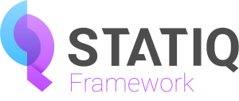

# Statiq Framework

Statiq Framework is a flexible and extensible static content generation framework for .NET. This project is an evolution of [Wyam](https://wyam.io).

[📖 Read the documentation](https://statiq.dev/framework) for updated quick start instructions as well as a more detailed guide.

[💬 Use the Discussions repo](https://github.com/statiqdev/Discussions/discussions) for assistance, questions, and general discussion about all Statiq projects.

[🐞 File an issue](https://github.com/statiqdev/Statiq.Framework/issues) if you find a bug or have a feature request related to Statiq Framework.

[💙 Support the project](https://www.statiq.dev/support/) if you find Statiq useful.

## Licensing

Statiq Framework is licensed under the MIT License and is open source software.

Note that projects which build on Statiq Framework such as [Statiq Web](https://github.com/statiqdev/Statiq.Web) and [Statiq Docs](https://github.com/statiqdev/Statiq.Docs) have different licenses.

Please see the [licensing FAQs](LICENSE-FAQ.md) for more information.